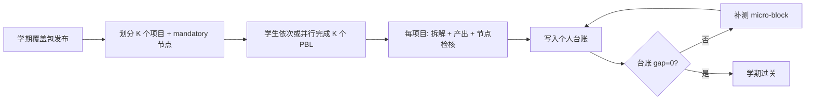

# 多 PBL 全覆盖模型 — 设计说明

**前提（产品北星）**

1. **逐渐撤掉分科课**，K12 课标全部由 PBL 体系覆盖。  
2. **每学期多个高强度 PBL**（不是 1 个主题走到底）。  
3. **每个学生**在本学期（或本学年）内 **100% 触达并掌握** 分配到的全部课标节点——不是「全班并集覆盖、个人走一条路径」。

当前 v0.1 实现（每学期 1 跨学科项目 + 个人路径 + 分科补 gap）是**过渡方案**；本文描述目标态及 PBL Map 应如何演进。

---

## 1. 核心机制：学期覆盖包（Semester Coverage Pack）

一个学期 = **1 个覆盖包**，内含 **K 个 PBL 项目**，对学期课标节点做 **划分（partition）**：

```
学期课标节点集 S（如 G11 下 ≈110）
  = PBL-1 必达节点 ∪ PBL-2 必达节点 ∪ … ∪ PBL-K 必达节点
  （两两不交，并集 = S）
```

| 规则 | 说明 |
|------|------|
| **人人必做** | 每个学生必须完成包内 **全部 K 个项目**（不是 N 选 1） |
| **节点必达** | 每个项目有 `mandatoryNodeIds`；产出检核未覆盖则不能结项 |
| **驱动问可个性化** | 主题壳 + 个人问法，但 **mandatory 节点清单不变** |
| **个人台账** | `studentCoverageLedger[studentId][nodeId]` = gap / mention / mastered |

撤分科课的含义：节点不再由「每周数学课、每周物理课」教，而由 **K 个项目的时间线 + 项目内微课时（micro-block）** 完成。

---

## 2. 需要多少个项目？（日历约束）

假设每个 PBL **深度掌握**约 **10–14 个核心节点**（含产出证据 + 过关检核），周期 **2–4 周**。

| 学段 | 每学期节点约 | 建议 K（项目数） | 每项目节点 | 每项目周数 | 学期 PBL 总周* |
|------|-------------|------------------|------------|------------|----------------|
| 小学 G1–G2 | 17–19 | **2** | 8–10 | 3–4 | 6–8 |
| 小学 G3–G6 | 20–27 | **2–3** | 9–12 | 3–4 | 8–12 |
| 初中 G7–G9 | 59–64 | **4–5** | 12–14 | 2–3 | 10–14 |
| 高中 G10 | ~98 | **6–7** | 14–16 | 2–3 | 14–18 |
| 高中 G11 | ~110 | **7–8** | 12–14 | 2–3 | 16–20 |
| 高中 G12 | ~72 | **5–6** | 12–14 | 2–3 | 12–15 |

\* 可与短「整合周/检核周」穿插；高强度意味着 PBL 周占学期 **70–85%** 课时，余量用于台账补测与答辩。

**G11 下 110 节点示例（8 个项目 × ~14 节点）**

| 序号 | 项目主题（示例） | 必达节点约 | 周数 |
|------|------------------|------------|------|
| 1 | 算法与数据基础 | 14 | 2 |
| 2 | 偏见、统计与证据 | 14 | 2 |
| 3 | 隐私与安全 | 14 | 2 |
| 4 | 透明与可解释 | 14 | 2 |
| 5 | 问责与治理 | 14 | 2 |
| 6 | AI 与劳动/社会 | 14 | 2 |
| 7 | 环境与可持续 AI | 14 | 2 |
| 8 | 伦理 capstone + 答辩 | 12 | 3 |

合计 ~110 节点、~17 周 PBL 核心时段 + 1–2 周总检核——**可行但极高强度**；需全校排课与师资协同。

---

## 3. 两种「掌握」等级（否则 K 会爆炸）

若 110 节点全部按「项目级深度掌握」不现实，采用 **两级检核**：

| 等级 | 含义 | 检核方式 | 在包内占比建议 |
|------|------|----------|----------------|
| **M（Mastered）** | 会用在产出中，能迁移 | 项目产出 rubric + 节点检核题 | 40–50% 节点 |
| **C（Certified）** | 在项目内完成微块学习 + 短测达标 | 5–15 分钟 KP 检核 / 嵌入 quiz | 50–60% 节点 |

撤分科 ≠ 每个节点都写进长篇报告；**C 级**用项目内 **micro-block**（15–25 分钟）+ 检核，仍算 PBL 时段内完成，不回到分科教室。

个人台账：`mastered | certified | gap`；学期关门条件：**gap = 0**。

---

## 4. 学生如何「人人全覆盖」（流程）



**与「一人一条自由路径」的区别**

| | 当前 v0.1 | 目标态 |
|--|-----------|--------|
| 项目数/学期 | 1 | K（2–8） |
| 节点分配 | 路径召回，人人不同 | **划分**，人人相同必达集 |
| 覆盖对象 | 班级并集 | **个人 100%** |
| 驱动问 | 高度个性化 | 个性化但 **mandatory 不变** |
| 分科课 | 补 gap | **撤掉**，gap 用包内补测 |

TeachAny 用法调整：

- 每次 PBL 拆解时，goal 中注入 **mandatoryNodeIds** 约束（或 refine 阶段强制补齐）。  
- `pathPlan` 必须覆盖 mandatory 集；缺项 → 不能标记项目完成。

---

## 5. 逐渐撤分科课的路线图

| 阶段 | 分科课 | PBL 包 |
|------|--------|--------|
| **Phase A**（现在） | 主渠道 | 1 项目/学期，审计用 |
| **Phase B** | 语言/数理底层微技能 | 2–3 项目/学期，包内 C 级 micro-block 替代部分习题课 |
| **Phase C** | 仅保留测评与个别 IEP | 4–8 项目/学期，个人台账关门 |
| **Phase D** | 撤除 | 全 PBL + 台账 + 学期检核 |

**仍建议保留极薄层**（若课标明确要求）：音体美、口语流利度操练——可标为「非节点 skill drill」，不占 PBL 节点计数，或单独 skill pass。

---

## 6. PBL Map 产品应改什么

### 6.1 数据结构

```json
{
  "id": "g11-spring-pack",
  "grade": 11,
  "semester": "spring",
  "themeChain": "科技伦理",
  "nodePoolSize": 110,
  "projects": [
    {
      "id": "g11-spring-p1-algorithm",
      "title": "算法与数据基础",
      "weeks": 2,
      "mandatoryNodeIds": ["...", "..."],
      "certifiedNodeIds": ["..."],
      "themeShell": { "..." },
      "subjectFloor": { "..." }
    }
  ],
  "partitionRule": "disjoint-union-equals-grade-semester-pool",
  "completionRule": "all-projects-and-ledger-gap-zero"
}
```

### 6.2 功能

| 功能 | 说明 |
|------|------|
| **包编辑器** | 将学期节点池划分为 K 份，检查交并 |
| **个人台账** | 每生每节点 M/C/gap，导出家长/教务 |
| **项目闸门** | mandatory 未检核 → 不能进入下一 PBL |
| **build 脚本** | 从 `cn-k12-nodes` 自动划分 + 人工教研调主题 |
| **catalog** | 展示「包 → K 项目 → 各项目知识点」，非单项目 110 条混列 |

### 6.3 与 TeachAny

- 拆解 API / handoff 增加 `mandatoryNodes[]`。  
- 结项写入 `pbl_runs` 时带 **projectId + packId**，供台账聚合。

---

## 7. 诚实边界

1. **日历**：G11 一学期 110 节点全 M 级掌握，需 **7–8 个短周期 PBL**；排课必须优先保证，否则只能提高 C 级比例。  
2. **机械划分**：纯算法划分的节点（如「力矩」进 AI 伦理包）无意义——**划分后必须教研按主题重排**（见 G5 策划包做法）。  
3. **个性化**：人人全覆盖与问法个性化可并存：**mandatory 固定，拓展 optional**。  
4. **当前仓库**：`k12-pbl-curriculum.json` v2 已输出 **24 学期覆盖包** + `data/plans/*-pack.json`；`catalog.html` / `roadmap.html` 已对齐多 PBL 模型。算法划分仍需教研按主题重排（见 G5 策划包）。

---

## 8. 下一步实现建议

1. ~~选 G11 下做首个 semester-pack 样例~~ ✅ 已生成 24 包 · G11 为高密度样例  
2. ~~`catalog.html` 覆盖包视图~~ ✅  
3. ~~`studentCoverageLedger` localStorage 原型~~ ✅ `pack.html`  
4. ~~更新 `build-k12-pbl-curriculum.mjs`~~ ✅  
5. **教研**：按 G5 做法手工重排各子 PBL 节点与主题对齐  
6. **服务端**：个人台账持久化 + 班级关门检核 API

---

**一句话**：你的逻辑 = **学期覆盖包（K 个 PBL）× 节点划分 × 个人台账关门**；不是 **1 个 PBL × 自由路径 × 分科补洞**。
